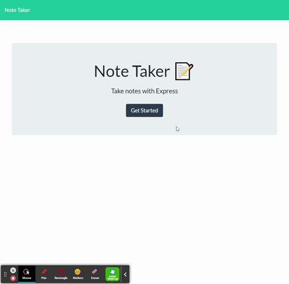

# Stark Bare Notes
[](https://opensource.org/licenses/MIT)
[](code_of_conduct.md)

## Description 
A note-taking application to write and save notes so that you can can organize your thoughts and keep track of tasks you need to complete. 

### Tools
 - Frontend: HTML, Bootstrap, CSS, JavaScript
 - Backend: NodeJS, Express.js 
 - Database:  JSON

### [Deployed Link](https://stark-taiga-57338.herokuapp.com/)
### [GitHub repository](https://github.com/espinbrandon49/stark_bare_notes)

## Table of Contents 
  * [Usage](#usage)
  * [Demo Video](#demo)
  * [Installation](#installation)
  * [License](#license)
  * [Contributing](#contributing)
  * [Collaboration](#collaboration)
  * [Questions](#questions)

  ## Usage 
* Enter a new note title and the note  text, then a Save icon appears in the navigation at the top of the page
* The new note is saved and appears in the left-hand column with the other existing notes
* Click on an existing note title in the list in the left-hand column and that note appears in the right-hand column in full
* Click on the Write icon in the navigation at the top of the page to return to enter a new note title and the note’s text in the right-hand column

## Demo
 - 
  
## Installation
### Browser
* Runs in the browser
* Deployed Link: [https://stark-taiga-57338.herokuapp.com/](https://stark-taiga-57338.herokuapp.com/)

### Clone
Install node.js and NPM on windows, clone down the GitHub repository and install the npm packages.
1. Download and install [Node.js](https://nodejs.org/en/download/)
2. Clone the repository
```bash
git clone git@github.com:espinbrandon49/stark_bare_notes.git
```
3. Run npm install to install the npm dependencies from the [package.json](./package.json)
```bash
npm install
```

## License 
### MIT License 
The content of this application is licensed under the MIT License. 

[https://choosealicense.com/licenses/mit/](https://choosealicense.com/licenses/mit/) 

## Contributing 

[Contributor Covenant](https://www.contributor-covenant.org/)

## Collaboration
Jerome Chenette

## Questions 

Contact me by [E-mail](mailto:espinbrandon49@gmail.com) or [GitHub](https://github.com/espinbrandon49)